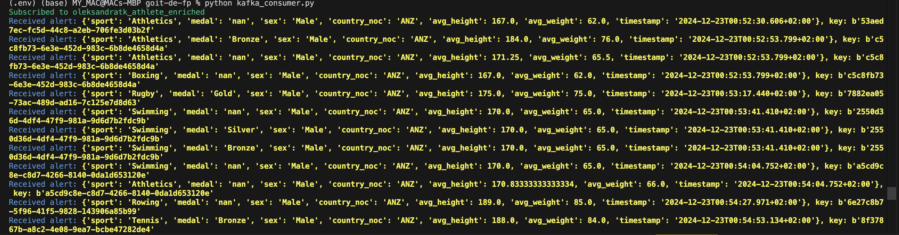
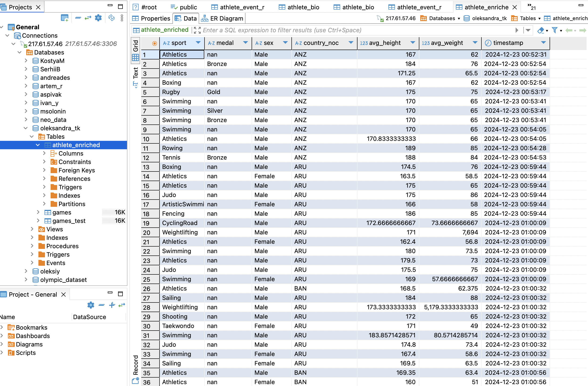
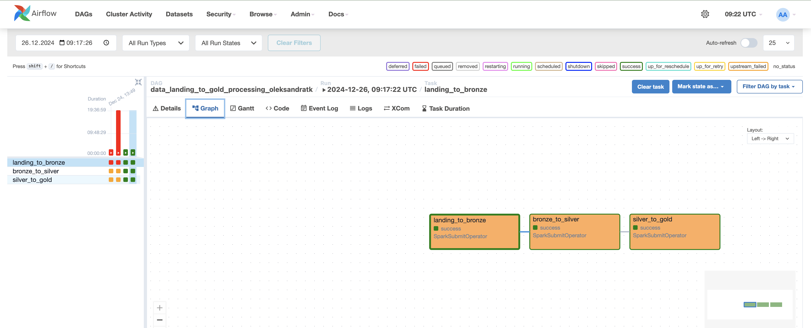
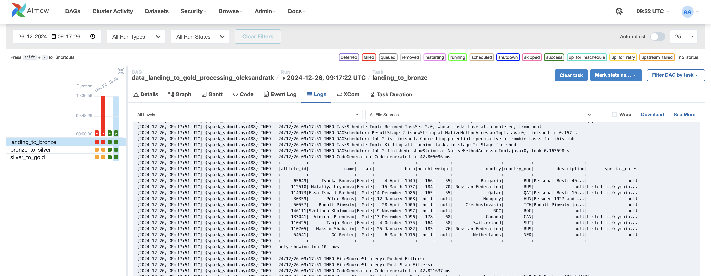
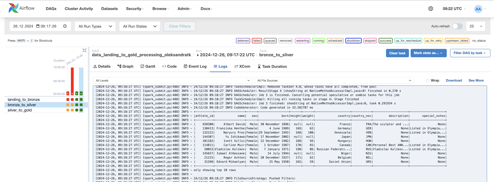
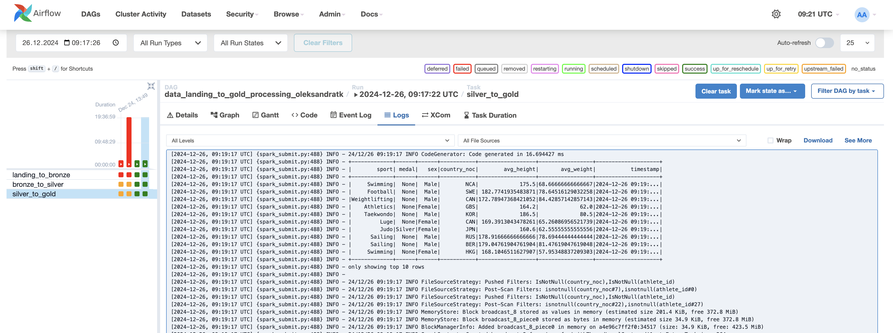
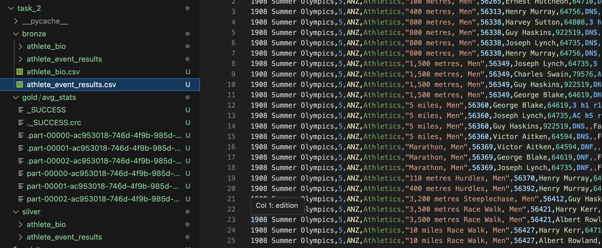

# goit-de-fp

Data Engineering final project. Implemented MySql data processing flow, building end-to-end pipeline using Kafka, Spark. Second part is devoted to Multi-hop Datalake building using Spark for ELT data processing and Airflow for sequentional tasks as one DAG running.

# --------------------------------------

# Part 1.

1. To read data from MySQL database and push them to Kafka topic run the next script:

```
python athlete_results_producer.py
```

2. To read data from both MySQL database and Kafka topic ru the next script. It causes the data join, batch processing in spark stream and enriched data microbatch pushing to both MySQL database and Kafka topic using FanOut pattern.

```
python streaming_pipeline.py
```

3. To read enriched data from Kafka topic run:

```
python kafka_consumer.py
```

The results of the enriched data pushing:





# --------------------------------------

# Part 2.

1. Build docker image from Dockerfile in order to install apache-airflow and apache-airflow-providers-apache-spark:

```
docker build . -f Dockerfile --pull --tag my-image:0.0.1
```

2. Start airflow-init:

```
docker compose up airflow-init
```

3. Start the whole container:

```
docker compose up
```

4. This command will serve Apache Airflow on localhost:8080. You can login with the name "airflow" or "admin" and password "airflow" or "admin".

5. Create new Spark connection.

Move to "Admin"->"Connection" and create new connection pointing ConnectionId="spark_default", ConnectionType="Spark", Host=local[*], Extra={"deploy-mode": "client", "spark-binary": "spark-submit"}

6. Use filter to find the dag "data_landing_to_gold_processing_oleksandratk".

7. Manually trigger the DAG execution. The results and graph of execution are shown below.

The DAG execution graph:



Landing to bronze step data table:



Bronze to silver step data table:



Silver to gold step data table:



The final multi-hop datalake is represented three folder bronze, silver and gold and contain data for different data processing stages


